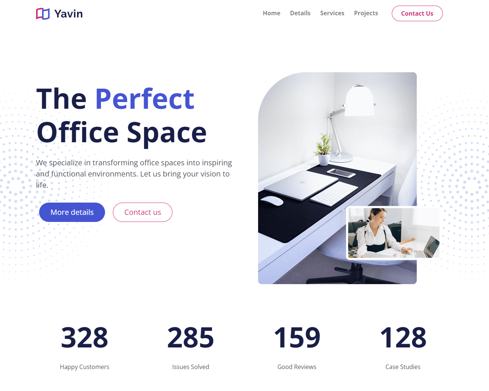

# Yavin Website

Bootstrap website for a company that creates and customizes office spaces. It could be used for just about any kind of business. It is a very light business theme with a clean design.



## Features

- Clean design with background images/patterns
- Responsive design
- Custom JavaScript for the stat counter
- Nav scroll effect
- Project area
- Testimonial slider/carousel
- Contact form
- Inner article page
- Font awesome icons

## Usage

This website is built with [Bootstrap](https://getbootstrap.com/) and [Sass](https://sass-lang.com/). It uses [Font Awesome](https://fontawesome.com/) for icons.

In order to customize this website, you need to install [Node.js](https://nodejs.org/en/). Then, clone this repository and run:

```bash
npm install
```

This will install Bootstrap, Sass and Font Awesome. To build your CSS files from Sass, run:

```bash
npm run sass:build
```

To watch your Sass files for changes, run:

```bash
npm run sass:watch
```

## "Why this project?" and a long advice

Welcome to my cozy online corner, created for the sheer joy of learning and sharpening our skills. Take a peek at [my GitHub profile](https://github.com/edg96), and you'll find projects that highlight my journey with [Python](https://www.python.org/) (also with some [CustomTkinter](https://github.com/TomSchimansky/CustomTkinter) - my trusted companion in crafting user-friendly GUI applications).

[Bootstrap](https://getbootstrap.com/) is our hero for those eager to launch a website decked with ready-to-use components straight off the shelf, simplifying the front-end development process significantly. It's the go-to for getting your digital creation up and running with minimal fuss.

Yet, if you are all about putting a personal stamp on things, I wholeheartedly recommend diving into the realms of [HTML](https://www.w3schools.com/html/), [CSS](https://www.w3schools.com/css/), and [JavaScript](https://www.w3schools.com/js/). These tools are your keys to the kingdom of front-end development, unlocking endless possibilities for customization. While Bootstrap offers flexibility, allowing for some customization with SASS to dial down its distinctive look, its essence might still peek through in your project's overall flair.

And here's a little extra advice: take a moment to explore [Tailwind](https://tailwindcss.com/). I view it as Bootstrap's sprightlier sibling, offering an even broader canvas for personalizing your front-end aesthetic. It's definitely worth exploring for those who relish the idea of marrying convenience with creativity.

So, whether you're here to explore, learn, or forge something that's unmistakably yours, remember: the path to personalization isn't just about the end product but the rich experiences and growth you'll encounter along the way.
